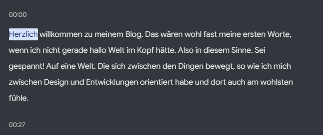
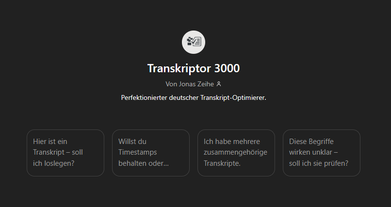
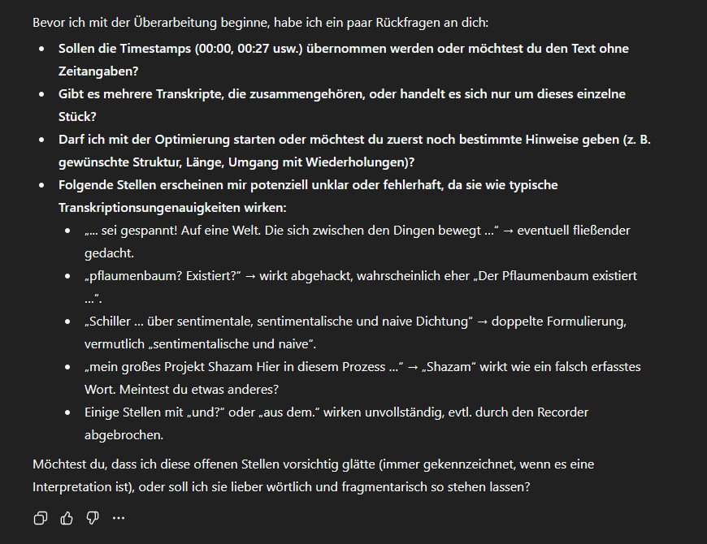

# Einführung in meinen Blog

Herzlich willkommen zu meinem Blog. Das wären wohl fast meine ersten Worte, wenn ich nicht gerade **„Hallo Welt“** im Kopf hätte. Also in diesem Sinne: _Sei gespannt auf eine Welt, die sich zwischen den Dingen bewegt_ – so wie ich mich zwischen **Design** und **Entwicklung** orientiert habe und dort auch am wohlsten fühle.

Es ist mir ein Anliegen, in diesem Blog nicht einfach nur Tutorials oder Anleitungen zu veröffentlichen, sondern **Eindrücke, Gedanken oder vielleicht auch kleine Vorträge**. Eben abgeleitet aus dem, was mich so beschäftigt.

Für den allerersten Beitrag war ich überhaupt nicht sicher, was ich machen soll. Tatsächlich ist mir dann bei einem Spaziergang etwas aufgefallen.

---

## Inspiration aus der Natur

Wenn ich in der Natur bin, besinne ich mich gerne wieder zurück auf das, was für mich am meisten zählt. Ich finde dort Ruhe und Entspannung.

Und wie ich dann so durch die Gegend geschlendert bin, habe ich einen **Pflaumenbaum** gesehen – mit Früchten. Leider hatte ich keinen Obstpflücker dabei und konnte nichts davon essen, weil die Früchte alle zu hoch gewachsen waren.

> Aber da kam mir ein Gedanke: Der Pflaumenbaum existiert auf gewisse Art aus sich selbst heraus und pflanzt sich auch genauso weiter fort.

Da musste ich sofort an **Schiller** denken. Etwas, was mich sehr stark geprägt hat in meiner Jugend, war ein Auszug aus seinem Essay _Über naive und sentimentalische Dichtung_. Dort geht es um die Beschreibung von Natur, ihre Schönheit und Ästhetik, die wir Menschen so gerne wahrnehmen.

> „Natur wirkt aus sich selbst heraus.“ – Friedrich Schiller

Und genau das ist es letzten Endes auch, was mich immer wieder begeistert.

Deswegen dachte ich mir: Ich kann ja einfach den ersten Blogbeitrag auch auf gewisse Art **aus sich selbst heraus entstehen lassen**. Das heißt: Ich zeige hier, wie ich eigentlich meine Blogbeiträge erstelle.

---

## Mein Workflow für Blogbeiträge

Die Art, wie ich das mache, hat sich über die Jahre aufgebaut. Ich habe schon immer gerne frei Vorträge gehalten und Dinge erzählt oder erklärt. Daraus ist auf gewisse Art auch eine Fähigkeit entstanden, die ich dafür nutze.

In erster Linie muss man sich natürlich überlegen:

- Was möchte ich eigentlich erzählen?
- Was ist der Grundgedanke, die **Intention** hinter diesem Beitrag?

Wenn ich spazieren gehe, in der Natur bin oder irgendetwas mache, dann kommen diese Gedanken meistens nebenbei. Irgendwann formt sich daraus eine plastische Struktur.

Wenn ich mich bereit fühle und im richtigen Moment in der richtigen Stimmung bin, nehme ich mein Smartphone (**Google Pixel Modell**) und nutze den **Recorder**. Darüber mache ich eine Audioaufnahme, die zeitgleich mittlerweile sehr hochwertig ins Deutsche transkribiert wird.

Das heißt, ich nehme in einem Atemzug den gesamten Beitrag auf.

Als Transkript habe ich dann den gesamten Text zur Verfügung stehen – und siehe da: Alles ist schon fertig in meinen eigenen Worten.

Schreiben ist schön, aber mittlerweile fällt mir auf, dass ich anders schreibe, als ich spreche. Mir ist aber wichtig, mich so ausdrücken zu können, wie ich eigentlich denke. Und das tue ich am besten, wenn ich spreche.

Wenn ich dann dieses Transkript habe, kopiere ich es und füge es in einen eigens dafür aufgebauten **Custom-GPT** ein.

Dieser GPT ist öffentlich zugänglich. Wenn du das Plus-Abo hast, kannst du ihn gerne [nutzen](https://chatgpt.com/g/g-682b43bb8ecc81918b4393c5714669d0-transkriptor-3000), besuchen und ausprobieren.

Er ist so konzipiert, dass er Transkripte ordentlich weiterverarbeitet – und vor allem **vorher Fragen stellt**.

Denn Unklarheiten in der Transkription gibt es immer noch. Technisch gesehen können viele Wörter falsch interpretiert werden. Gerade die deutsche Sprache ist nach wie vor eine Herausforderung. Es klappt mittlerweile wirklich erstaunlich gut – besser als früher, auch wenn es zwischendurch schon mal besser war. Heute bin ich mit diesem Workflow sehr zufrieden.

---

## Vom Transkript zum fertigen Beitrag

Wenn ich das Transkript ordentlich aufgearbeitet habe, entsteht daraus schon der erste Entwurf.

In einem weiteren Schritt – in einem anderen Chat oder indem ich selbst den Beitrag überfliege – füge ich in **Markdown** sämtliche Formatierungen, Satzzeichen oder andere Bausteine hinzu. Ebenfalls kommen Materialien für Bilder oder in diesem Fall **Screenshots meiner Arbeit**, wie ich diesen Beitrag erstelle.

Nach einiger Zeit wächst daraus dann ein Beitrag, mit dem ich wirklich zufrieden bin.

Hier hast du also einen Überblick über die Art, wie ich meine Beiträge gestalte und warum sie sich trotzdem so lesen, als wären sie gesprochen. Ebenso bekommst du einen Eindruck von meiner mittlerweile **eng mit KI verwachsenen Arbeitsweise**.

---

## Haltung zur KI

Das hat Vor- und Nachteile. Ich merke, wie wichtig es ist, KI als Werkzeug zu benutzen.

Warum sage ich das so explizit? Ich könnte ja auch einfach Beiträge generieren lassen. Aber in meinen Augen ist das wertlos, weil ich mich als Person ausdrücken möchte. Das kann ich am besten in meinen eigenen Worten – und das tue ich nun mal, wenn ich selbst spreche und schreibe.

Ich möchte keinen Blog erzeugen, in dem einfach irgendein generischer Text entsteht.

Natürlich lasse ich Beiträge manchmal mit KI überarbeiten oder probiere aus, ganze Abschnitte generieren zu lassen. Aber es bleibt mir wichtig, dass ich **als Person interagiere**.

Denn sonst übernimmt irgendwann die künstliche Intelligenz alles – und wo wäre dann der Wert in dem, was ich tue, wenn ich es nicht selbst gemacht habe?

---

## Ausblick

Was dich hier im Blog noch erwartet, sind Themen, die mich seit Jahren beschäftigen – manche mehr, manche weniger. Einige sind sehr weit und organisch gewachsen, andere eher spontan und kurzfristig.

Ich habe auf jeden Fall vor, meine **Softwareprojekte** zu beleuchten, vor allem mein großes Projekt **Shizen** im Design- und Entwicklungsprozess – mit diversen Beiträgen.

Außerdem möchte ich auch andere Arbeitsweisen oder Gedanken einfließen lassen, wie zum Beispiel mein Konzept der **„natürlichen Entwicklung“**.

Dieses kollidiert ein wenig mit agiler Softwareentwicklung, **Scrum** oder auch dem **SAFe-Framework**. Vielleicht kann ich damit manches verbessern – oder zumindest Neues ausprobieren.

Ich möchte außerdem sehen, ob mir das Bloggen überhaupt liegt und ob es etwas ist, womit ich langfristig interagieren möchte.

---

### Danke fürs Lesen 🙏

In diesem Sinne: **Herzlichen Dank** fürs Lesen, viel Spaß mit den weiteren Beiträgen auf meinem Blog, und ich hoffe, dir hat diese kurze Einführung gefallen :)
