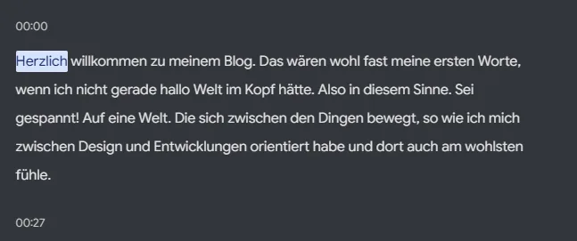
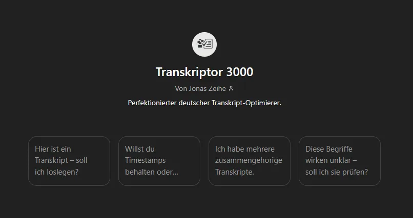
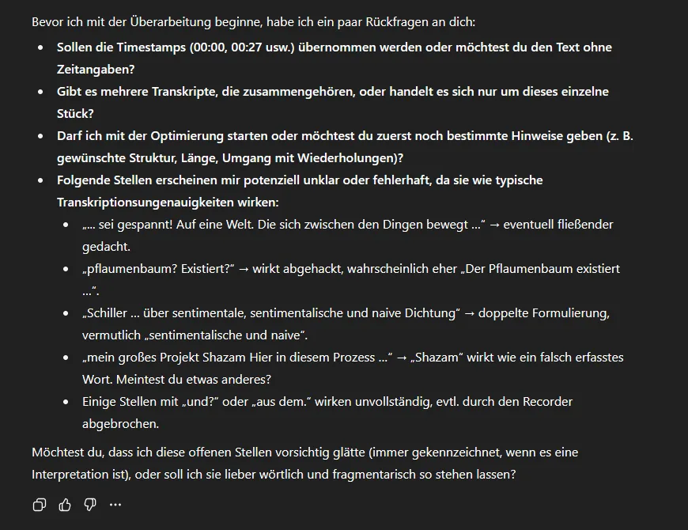

# Einführung in meinen Blog

Herzlich willkommen zu meinem Blog. Das wären wohl fast meine ersten Worte, wenn ich nicht gerade **„Hallo Welt“** im Kopf hätte. Also: _Sei gespannt auf eine Welt, die sich zwischen den Dingen bewegt_ – so wie ich mich zwischen **Design** und **Entwicklung** orientiert habe und dort am wohlsten fühle.

Es ist mir wichtig, hier nicht einfach nur Tutorials oder Anleitungen zu veröffentlichen, sondern **Eindrücke, Gedanken, kleine Vorträge** – abgeleitet aus dem, was mich beschäftigt.

Für den allerersten Beitrag war ich unsicher. Beim Spazierengehen kam mir dann ein Gedanke.

---

## Inspiration aus der Natur

Wenn ich draußen bin, besinne ich mich auf das, was zählt. Ich finde dort Ruhe und Entspannung.

Neulich sah ich einen **Pflaumenbaum** – voller Früchte, alle zu hoch zum Pflücken.

> Der Pflaumenbaum existiert aus sich selbst heraus und pflanzt sich genauso fort.

Da musste ich sofort an **Schiller** denken. Ein Text, der mich in meiner Jugend geprägt hat, ist sein Essay _Über naive und sentimentalische Dichtung_. Darin beschreibt er die Schönheit der Natur, die wir so gerne wahrnehmen.

> „Natur wirkt aus sich selbst heraus.“

Genau das begeistert mich bis heute. Also dachte ich mir: Mein erster Blogbeitrag soll ebenfalls **aus sich selbst heraus entstehen** – indem ich zeige, wie ich meine Beiträge mache.

---

## Mein Workflow für Blogbeiträge

Das hat sich über die Jahre entwickelt. Ich habe immer gerne frei gesprochen, erklärt, Vorträge gehalten – daraus ist eine Fähigkeit entstanden, die ich hier nutze.

Am Anfang stehen zwei Fragen:

- Was möchte ich erzählen?
- Was ist die Intention hinter dem Beitrag?

Solche Gedanken kommen oft unterwegs. Irgendwann bildet sich daraus eine Struktur.

Wenn ich bereit bin, nehme ich mein Smartphone (**Google Pixel**) und starte den **Recorder**. Ich mache eine Audioaufnahme, die zeitgleich sehr hochwertig transkribiert wird.

Das heißt: Ich nehme in einem Atemzug den gesamten Beitrag auf.

Das Transkript ist dann komplett da – in meinen eigenen Worten.

Mir fällt auf, dass ich anders schreibe, als ich spreche. Aber am ehrlichsten drücke ich mich aus, wenn ich spreche.

Das Transkript füge ich anschließend in meinen eigens dafür aufgebauten **Custom-GPT** ein.

Dieser GPT ist öffentlich zugänglich. Mit Plus-Abo kannst du ihn [nutzen](https://chatgpt.com/g/g-682b43bb8ecc81918b4393c5714669d0-transkriptor-3000).

Er ist so konzipiert, dass er Transkripte verarbeitet und **vorher Rückfragen stellt**.

Unklarheiten gibt es immer noch. Manche Wörter werden falsch interpretiert. Gerade Deutsch ist eine Herausforderung. Trotzdem funktioniert es mittlerweile erstaunlich gut – besser als früher. Mit diesem Workflow bin ich sehr zufrieden.

---

## Vom Transkript zum fertigen Beitrag

Aus dem Transkript entsteht der erste Entwurf.

Danach gehe ich den Text durch, füge **Markdown**, Satzzeichen und Screenshots hinzu – wie hier. Nach und nach wächst daraus ein Beitrag, mit dem ich zufrieden bin.

So siehst du, warum sich meine Texte so lesen, als wären sie gesprochen. Und du bekommst einen Eindruck von meiner **eng mit KI verwachsenen Arbeitsweise**.

---

## Haltung zur KI

KI ist für mich Werkzeug.

Ich könnte auch komplette Texte generieren lassen – aber das wäre wertlos, weil ich mich selbst ausdrücken will. Das geht nur in meinen eigenen Worten, wenn ich selbst spreche und schreibe.

Ich nutze KI, um zu überarbeiten oder Ideen auszuprobieren. Aber wichtig bleibt: **Ich interagiere als Person.**

Denn sonst übernimmt irgendwann die KI alles – und was wäre dann der Wert, wenn ich es nicht selbst gemacht habe?

---

## Ausblick

Hier im Blog erwarten dich Themen, die mich seit Jahren beschäftigen – manche tiefer, manche spontaner.

Ich möchte meine **Softwareprojekte** beleuchten, vor allem mein großes Projekt **Shizen** im Design- und Entwicklungsprozess.

Außerdem werde ich über meine Arbeitsweisen schreiben, zum Beispiel mein Konzept der **„natürlichen Entwicklung“** – das teilweise im Kontrast zu agiler Softwareentwicklung, **Scrum** oder dem **SAFe-Framework** steht. Vielleicht bringt das Neues hervor.

Und ich will herausfinden, ob Bloggen überhaupt etwas ist, womit ich langfristig arbeiten möchte.

---

### Danke fürs Lesen 🙏

**Herzlichen Dank** fürs Lesen. Viel Spaß mit den weiteren Beiträgen – und ich hoffe, dir hat diese Einführung gefallen :)
