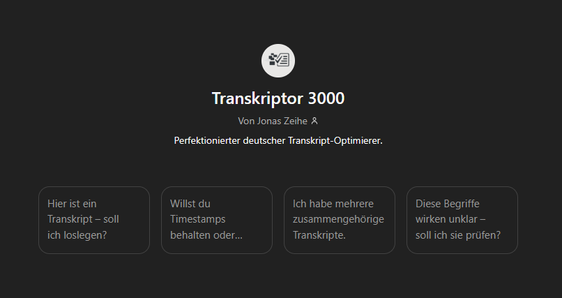

# Einführung in meinen Blog

Herzlich willkommen zu meinem Blog. Fast hätte ich mit **„Hallo Welt“** begonnen – aber eigentlich passt etwas anderes besser: _Sei gespannt auf eine Welt, die sich zwischen den Dingen bewegt_ – so wie ich mich zwischen **Design** und **Entwicklung** orientiere und dort auch am wohlsten fühle.

Was dich hier erwartet, sind keine reinen Tutorials. Keine bloßen Anleitungen. Sondern **Eindrücke, Gedanken, kleine Vorträge**. Dinge, die mich beschäftigen – und die vielleicht auch dich berühren.

Für diesen ersten Beitrag war ich lange unsicher. Aber dann, beim Spazierengehen, kam mir ein Bild.

---

## Inspiration aus der Natur

In der Natur finde ich Ruhe. Sie erdet mich und erinnert mich daran, was zählt.

Neulich stand ich vor einem **Pflaumenbaum**. Voller Früchte – und doch außer Reichweite. Ich hatte keinen Obstpflücker dabei, und die Pflaumen waren zu hoch.

In diesem Moment dachte ich: Der Baum wächst einfach. Er trägt Früchte, weil es in seiner Natur liegt. Er existiert aus sich selbst heraus.

Das erinnerte mich sofort an **Schiller**. In seiner Schrift _Über naive und sentimentalische Dichtung_ hat mich ein Satz tief geprägt:

> „Natur wirkt aus sich selbst heraus.“ – Friedrich Schiller

Und genau so möchte ich meinen Blog beginnen: nicht geplant, sondern organisch. Ein Beitrag, der sich aus sich selbst heraus entfaltet.

---

## Mein Workflow für Blogbeiträge

Wie entstehen meine Texte?

Ich habe schon immer gerne frei gesprochen, Vorträge gehalten, Dinge erklärt. Daraus ist eine Fähigkeit gewachsen, die ich heute nutze.

Meistens beginnt es mit einem Gedanken unterwegs. Beim Gehen, beim Schauen. Aus diesen Gedanken bildet sich eine Struktur. Und wenn der Moment stimmt, nehme ich mein Smartphone (**Google Pixel Modell**) und starte den **Recorder**.

Ich spreche den gesamten Beitrag in einem Atemzug ein. Sofort habe ich eine Transkription, erstaunlich präzise und nah an meinen eigenen Worten.

So schreibe ich nicht – ich spreche. Und genau dadurch drückt der Text das aus, was ich wirklich denke.

Das Transkript landet anschließend in einem eigens gebauten **Custom-GPT**. Er hilft mir, offene Fragen zu klären und Fehler zu glätten.

Dieser GPT ist öffentlich zugänglich. Wenn du das Plus-Abo hast, kannst du ihn gerne [nutzen](https://chatgpt.com/g/g-682b43bb8ecc81918b4393c5714669d0-transkriptor-3000), besuchen und ausprobieren.

Natürlich versteht die Technik nicht jedes Wort perfekt – gerade im Deutschen. Aber das Ergebnis ist stark genug, um darauf zu bauen.

---

## Vom Transkript zum fertigen Beitrag

Aus dieser Rohfassung entsteht der erste Entwurf. Danach gehe ich noch einmal durch: Ich ergänze **Markdown**, füge Bilder oder Screenshots hinzu – und Schritt für Schritt wächst daraus ein vollständiger Blogartikel.

Das Entscheidende bleibt: Alles kommt zuerst aus meinem Kopf, aus meiner Stimme.

---

## Haltung zur KI

KI ist für mich ein Werkzeug – nicht mehr, nicht weniger.

Ja, ich könnte meine Beiträge einfach generieren lassen. Aber das wäre leer. Ich will mich als Person ausdrücken. Dafür brauche ich meine eigenen Worte, meine eigene Art zu sprechen und zu denken.

KI hilft mir beim Überarbeiten, beim Strukturieren, manchmal auch beim Ausprobieren. Aber die Seele bleibt bei mir.

Denn wenn KI irgendwann alles übernimmt – wo bliebe dann der Wert meines eigenen Tuns?

---

## Ausblick

In diesem Blog wirst du meine Projekte begleiten können, vor allem mein großes Projekt **Shizen**, an dem ich im Design- und Entwicklungsprozess arbeite.

Daneben möchte ich meine Arbeitsweisen teilen, zum Beispiel mein Konzept der **„natürlichen Entwicklung“**. Es steht im Kontrast zu gängigen Frameworks wie **Scrum** oder **SAFe** – und vielleicht öffnet es neue Wege.

Und noch etwas will ich herausfinden: Liegt mir das Bloggen überhaupt? Ist es eine Form, mit der ich langfristig in Resonanz gehe?

---

### Danke fürs Lesen 🙏

Danke, dass du diesen ersten Beitrag gelesen hast. Ich freue mich, wenn du mich auf diesem Weg begleitest – zwischen Entwicklung und Design, zwischen Technik und Natur, zwischen Gedanken und Worten.

Hier beginnt mein Blog – und er darf sich weiter aus sich selbst heraus entwickeln.
