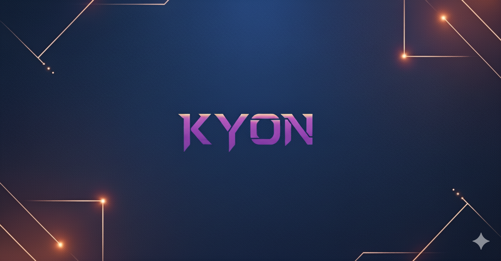

# Kyon: Ein Blog, der Prozesse zeigt

Ich starte **Kyon**, weil ich Platz brauche – für das, was unterwegs passiert.  
Zwischen Anfang und Ergebnis. Zwischen Idee und Umsetzung.

Das Meiste zeigt sich nicht im fertigen Produkt, sondern im Skizzieren, Zweifeln, Neuordnen.  
Dort entsteht Richtung. Und manchmal sogar Klarheit – oder etwas völlig Neues.

**Kyon** ist kein Tutorial-Depot. Kein Showroom. Kein persönliches Logbuch.  
Sondern ein Ort, an dem Denken und Machen sich zeigen dürfen – ohne Maske, ohne Marketingsound.

**Prozess statt Pose. Natürlichkeit vor Methode.**  
Oder, daoistisch gesagt: _Ziran_ – das, was aus sich selbst heraus geschieht.

---

## Was dich hier erwartet

- **Fallbeispiele** aus echten Projekten – von CI/CD-Setups mit Java & Spring Boot bis UI-Prototypen in Figma.
- **Entscheidungsnotizen**: 1 Problem, 1 Gedanke, 1 möglicher Weg.
- **Mini-Vorträge im Blogformat** – spontan, aber mit Substanz.
- **Zwischentöne**: Reflexionen aus dem Alltag zwischen Code, Konzept und Körpergefühl.

> Ich schreibe, wie ich arbeite: mit Struktur, Neugier und einem Gespür für den richtigen Moment.

---

## Was du hier nicht findest

Keine Buzzwords. Kein Methoden-Zirkus.  
Keine hohlen Claims oder Phrasen mit Performance-Anzug.

Ich teile, was sich **bewegt, bewährt – oder noch in der Schwebe ist**.  
Und manches, das einfach nicht fertig werden will. Vielleicht nie.

---

## Was ich tue – beruflich

Ich arbeite zwischen **UX, UI und Webentwicklung**.  
Im Gepäck: **Figma, React, TypeScript, Java, Spring Boot, Python**, manchmal auch Kotlin.  
Ich denke in Systemen, baue iterativ – und bleibe nah am Problem.

Ob klickbarer Prototyp, wartbare Architektur oder durchdachte Schnittstelle:  
**Was ich anpacke, soll tragen. Und verständlich bleiben.**

Ich arbeite gerne mit Teams, die offen denken. Und mit Menschen, die Haltung wertschätzen.

---

## Wer hier schreibt

Mein Weg war nie gerade – aber immer wach.  
**Sozialarbeit, Waldarbeit, Handwerk, UX, Code.**

Ich mag Dinge, die man anfassen kann. Und Gedanken, die sich nicht sofort greifen lassen.  
Mich interessiert das Dazwischen: Körper und Kopf. Denken und Tun.  
**Form und Fluss.**

Ich bin ein Hybrid mit Werkzeugkasten. Wenn du selbst keiner Schublade traust: willkommen.

---

## Kontakt

Kein Kommentarbereich. Kein Social-Feed.  
Aber eine E-Mail-Adresse – für Fragen, Projektideen oder einfach Resonanz.  
Schreib mir, wenn du was teilen willst.

---

### Zum Abschluss

Kyon ist ein Versuch.  
Nicht etwas zu erklären – sondern etwas sichtbar zu machen.  
Nicht Wissen zu verteilen – sondern Raum zu öffnen.

**Manche Dinge brauchen keine Bühne. Nur Resonanz.**
